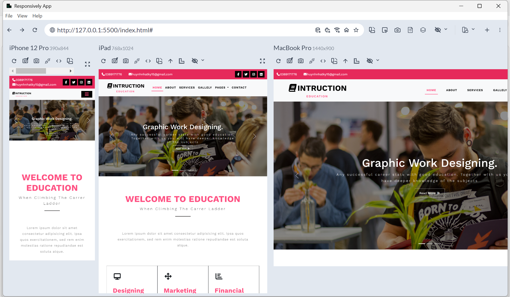

# 🎓 Instruction Education - Landing Page

Dự án thực hành xây dựng giao diện trang web giáo dục (Instruction Education) hiện đại. Điểm nhấn lớn nhất của phiên bản này là việc áp dụng thành thạo Bootstrap 5 và CSS Custom để trang web hiển thị hoàn hảo trên mọi kích thước màn hình (Responsive Design).

🎯 **Live Demo:** (https://nhatky31.github.io/instruction-education-web-design/)
## 📸 Giao diện dự án

### 1. Hiển thị đa thiết bị (Responsive)
Trang web được tối ưu hóa giao diện cho Mobile, Tablet và Desktop, đảm bảo trải nghiệm người dùng xuyên suốt:

### 2. Tổng quan trang web (Desktop View)

## 🚀 Công nghệ sử dụng
* **Cấu trúc & Giao diện:** HTML5, CSS3, Bootstrap 5.3.8.
* **Xử lý Responsive:** Sử dụng hệ thống Grid linh hoạt của Bootstrap kết hợp viết `@media` queries tùy chỉnh cho các điểm gãy (breakpoints) từ 360px đến 1199px.
* **Thư viện ngoài:**
    * FontAwesome (Icons)
    * Google Fonts (Montserrat, Roboto, Work Sans)
    * Owl Carousel 2 (Tạo hiệu ứng trượt mượt mà cho phần Testimonials)

## 💡 Điểm nổi bật trong Code
* Tích hợp thanh điều hướng (`Navbar`) của Bootstrap, tự động thu gọn thành menu Hamburger tiện lợi trên thiết bị di động.
* Phân chia bố cục HTML theo từng thẻ ngữ nghĩa rõ ràng (`<header>`, `<section>`, `<footer>`).
* Sử dụng CSS Custom để ghi đè phong cách mặc định của Bootstrap, tạo các hiệu ứng Hover, Transition mượt mà cho nút bấm và liên kết.

## 👨‍💻 Thông tin tác giả
* **Phát triển bởi:** Huỳnh Nhật Ký
* **Chuyên ngành:** Công nghệ thông tin (Khóa 2020 - 2024)